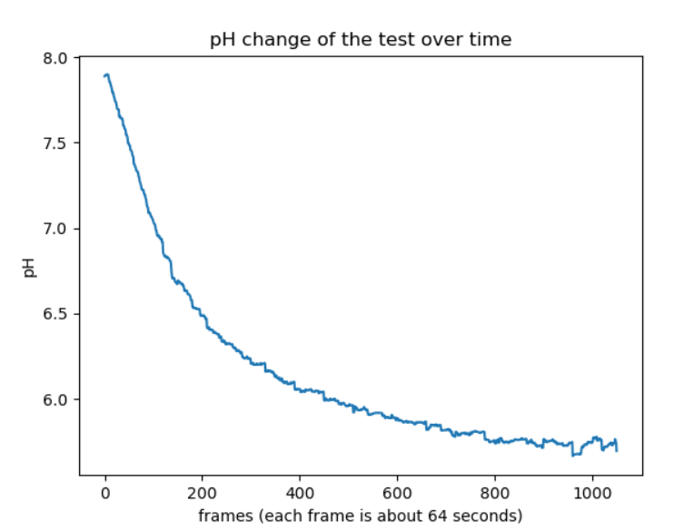
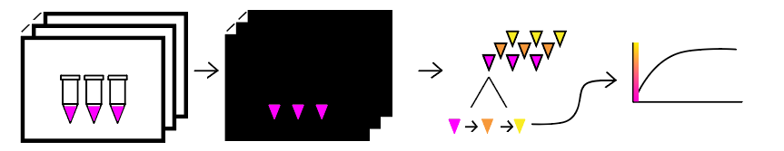
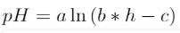

# Modelling
TAS_Taipei developed our own script, VisualpH, that measures the pH of a solution, or even the change in pH over time with just a photo or video. This allows the quantification of pH data for small volumes of solutions where we are unable to use a conventional pH meter. With this software we are able to model the reaction and find the relations between different reactants to optimize the reaction time.

## VisualpH

VisualpH is a python script that utilizes the openCV api to analyze photos and videos and extract pH data from it. The software takes the average hue of each tube at every frame, and using a standard generated from the pH indicator used, the hue can be converted to ph. 

The location of each tube is first selected by the user, and the software then collects the values of those pixels at every frame in the video. The RGB data is converted into HSV, but only the hue data is used. 

The hue can be converted to pH using the following equation where *pH* is the pH, *h* is hue, and *a*, *b*, *c* are constants. 

Using this equation, we can get a model of the advancement of the reaction over time. 
